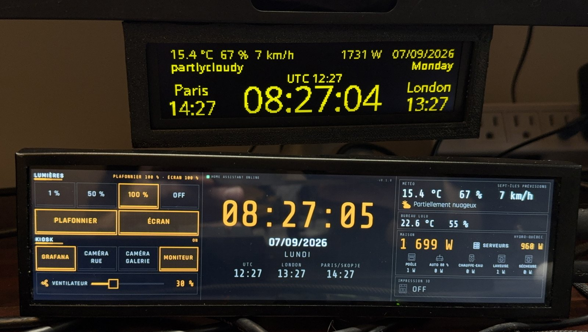

# barclock

A clock and Home Assistant dashboard for a 1920x480 HDMI touch bar, running on a Raspberry Pi Zero 2W.
It replaced an ESP32 driving a small OLED, which had run out of room years ago.



The old clock is the one on top, before it got replaced.

:warning: This is a personal project, built for one desk in one house. It's hardcoded to my setup all
over the place: my entity IDs, my French labels, my time zones, my IoTaWatt channel names. Nothing
here auto-discovers anything. If you want to run it you'll be editing `barclock.toml` for a while,
and probably `ui/app.slint` too. Don't expect any support.

## What you need

- A Raspberry Pi Zero 2W (or anything running Debian with KMS), on Raspberry Pi OS Lite, 64 bit
- A 1920x480 HDMI touch bar, the 8.8 inch IPS strip sold
  [all over AliExpress](https://www.aliexpress.com/w/wholesale-8.8-1920%C3%97480-ips-touch-strip.html).
  Mine reports itself as `ZeroMOD` and only offers 480x1920 portrait, so barclock renders rotated
- A Home Assistant instance with a long-lived access token
- Optionally an MQTT broker, if you want to dim the screen from Home Assistant. Keep in mind that
  there's no backlight control on this panel, so dimming only darkens the UI and the backlight stays
  on either way
- Optionally an IoTaWatt, if you want live power instead of Home Assistant's 30 second refresh

The Pi runs the binary directly on the framebuffer through Slint's linuxkms backend. There's no X,
no Wayland and no desktop, which is the whole point on 512 MB of RAM.

## How to build

You don't build on the Pi. It has 415 MB of usable RAM and a cold build swaps itself to death.

Build in the arm64 Debian trixie container instead, which carries exactly the same dev packages the
Pi has, so the binary links against the same glibc and libinput:

```bash
docker build --platform linux/arm64 -t barclock-build deploy/docker
deploy/docker/cargo.sh build --release
```

`deploy/docker/cargo.sh` runs any cargo command in that container and keeps the crate registry and
the target directory in named Docker volumes, so rebuilds are incremental. Run the tests the same
way with `deploy/docker/cargo.sh test`.

On an Apple Silicon Mac this runs natively. On x86_64 it works through qemu, slowly.

Keep in mind that the target directory is shared by every checkout mounted at `/src`, so if you
build from a second clone, run `touch src/*.rs` first or cargo may hand you the other tree's
artifacts.

The GitHub Actions workflow in `.github/workflows/build.yml` does the same thing on an arm64 runner
and uploads the binary. Those runners are free on public repos.

You can also check the layout without any hardware:

```bash
deploy/docker/cargo.sh run --release -- --preview /src/preview.png --preview-state busy
```

That renders the whole UI headlessly with the software renderer. The states are `normal`,
`connecting`, `dim`, `busy`, `paused`, `error`, `idle`, `toast` and `touchtest`.

## How to install

- Clone it from [GitHub](https://github.com/lululombard/barclock)
- Build the binary as above and copy it to the Pi
- Run `sudo deploy/install.sh ./barclock` on the Pi

The install script creates the `barclock` system user, drops the binary in `/opt/barclock`, installs
`/etc/barclock.toml` and `/etc/barclock.env` if they're missing, installs the systemd unit and the
udev rule for the touch controller, and masks `getty@tty1` so the login prompt stops fighting you
for the screen.

After that it's a normal service:

```bash
sudo systemctl restart barclock
journalctl -u barclock -f
```

## Config

There are two files. Secrets and endpoints live in the env file, everything else in the TOML.

### /etc/barclock.env

This one is `0640 root:barclock` because it holds the token.

- `HA_TOKEN` is the Home Assistant long-lived token, from your profile then Security. With an empty
  token the service still starts, logs an error and shows `HA_TOKEN MANQUANT` on the connecting
  screen, so you can see what's wrong from across the room
- `MQTT_USER` and `MQTT_PASSWORD` are the broker credentials. Empty means anonymous, which is logged
  as a warning. With the Mosquitto add-on the login has to be a Home Assistant user or one listed in
  the add-on's `logins`
- `HA_URL`, `MQTT_HOST` and `MQTT_PORT` override the TOML endpoints if you'd rather keep them here.
  `HA_URL=https://<homeassistant_host>` is rewritten to `wss://<homeassistant_host>/api/websocket`
- `SLINT_BACKEND` is `linuxkms-software` by default. See "Why the software renderer" below
- `SLINT_KMS_ROTATION` is set from the config, you shouldn't need it
- `RUST_LOG` is `info`. Set it to `debug` to see every Home Assistant frame and every MQTT message

### /etc/barclock.toml

Every key is optional, an empty string switches a feature off. The interesting ones:

- `[general] timezone` and `language`, which is `fr` or `en` and changes weekday names, weather
  labels and the printer status words
- `[general] indoor_label` captions the indoor temperature box under the weather
- `[clock] zones` is the row of extra clocks under the date, in config order. Mine are UTC, London,
  Paris/Skopje and Dubai
- `[homeassistant] url`, plus `ping_interval_s` (5 to 3600), `backoff_min_s` and `backoff_max_s`
  (1 to 3600), `call_timeout_s` (1 to 600) and `connecting_after_s` (0 to 600). Values outside those
  ranges are rejected at startup rather than misbehaving later
- `[mqtt] host` is the broker's LAN address. Port 1883 usually isn't reachable through a WAN name,
  so this is separate from the Home Assistant URL on purpose
- `[mqtt] keepalive_s` is clamped to 5 to 65535, because rumqttc panics on 0 and truncates the
  CONNECT keepalive to a u16
- `[entities]` maps every control and reading to a Home Assistant entity. This is the part that's
  entirely mine
- `[thresholds]` decides when a load counts as running, like `stove_flame_w` for the range
- `[display] rotation`, `default_brightness`, `wake_brightness`, `wake_seconds`, `dpms_off` and
  `dpms_delay_ms`
- `[iotawatt]` is described below

Config options are documented inline in `deploy/barclock.toml`, which is the file the installer
copies, so read that one for the full list.

## How it works

Everything runs in two threads. Slint owns the main thread and the DRM device, and a tokio
current_thread runtime handles Home Assistant, MQTT and the IoTaWatt on a second thread. They talk
over channels, and every UI write goes back through `slint::invoke_from_event_loop`.

### The clock

The big clock repaints once a second, from a single shot timer re-armed just after each whole
second. It reads the real system time every tick, so a late tick corrects itself instead of
drifting. `HH:MM:` and `SS` are separate items so only the seconds repaint.

Time comes from the Pi, never from Home Assistant. `systemd-timesyncd` keeps it within a few
milliseconds.

### Home Assistant

barclock subscribes to the entities named in `[entities]` over the WebSocket API and never polls.
Reconnects use exponential backoff from `backoff_min_s` to `backoff_max_s`, and the delay only
resets after a session that stayed up for 60 seconds, so a connection that dies right after
authenticating backs off properly instead of hammering.

An invalid token is retried only every 15 minutes, because Home Assistant counts failed logins and
will ban the Pi's IP if you keep trying.

Pressing a control sends the service call and marks the button pending. Pending clears when Home
Assistant pushes the new state back, or on a failure, or after `call_timeout_s` with a toast. No
button ever shows a state Home Assistant hasn't confirmed, which means a dead automation looks dead
instead of looking fine.

### Brightness and turning the screen off

The panel appears in Home Assistant as an MQTT light called "Bar display", through MQTT discovery.
Home Assistant can't create that entity over the WebSocket API, which is the only reason the broker
is involved at all.

Brightness is a black overlay drawn over the whole UI, not a real backlight, because this panel
doesn't expose one. Turning it down makes the picture darker and the backlight carries on at full
blast, so it looks dimmer in a dark room and saves you exactly zero watts.

Off is a black frame, then the UI freezes, then DPMS Off cuts the HDMI signal about 1.4 seconds
later. The picture goes away, the backlight doesn't, so you end up with a lit black rectangle. See
"What doesn't work" for why that can't be fixed in software.

:warning: Nothing may be drawn while the CRTC is off. A page flip on a switched off CRTC fails and
takes the event loop with it, which is why the UI freezes before the signal is cut.

Touching a dark or dimmed screen wakes it for `wake_seconds` without changing the Home Assistant
entity, so a wake doesn't turn your lights back on by accident.

The last brightness is written to `/var/lib/barclock/brightness` and also retained on the broker. At
boot the file is read first, then the broker's retained state wins if it arrives within 1.5 seconds.

### Live power from the IoTaWatt

Home Assistant's IoTaWatt integration refreshes on a fixed 30 second cycle, so the house total used
to step once every half minute. The device recomputes every second, so barclock polls it directly:

```toml
[iotawatt]
url = "http://<iotawatt_host>/"
house_output = "HydroQuebec"
servers_input = "Serveurs"
poll_interval_ms = 1000
```

`house_output` is a named output on the device, `servers_input` is a named input which gets resolved
to its channel number through `/config.txt`. If the monitor stops answering, both values fall back
to the Home Assistant sensors and come back on their own.

Please notice that the device says `Connection: close` and then sits on the socket for about a
second before actually closing. If you write your own client, read exactly `Content-Length` bytes
and stop, or every request will look like a timeout. That one cost me an evening.

### Rotation and touch

The panel's only mode is 480x1920 portrait, so barclock renders a 1920x480 window rotated by 90
degrees. Use 270 if your picture is upside down.

Slint maps libinput's calibrated coordinates straight onto the rotated window and doesn't rotate
touch itself, so the touch controller needs its own matrix. `deploy/udev/99-barclock-touch.rules`
sets it for USB device 1a86:e5e3:

```
LIBINPUT_CALIBRATION_MATRIX="0 1 0 -1 0 1"
```

The rule file lists the alternatives for the other rotations. To check your corners:

```bash
sudo systemctl stop barclock
sudo systemd-run --unit=barclock-touchtest -p User=barclock -p Group=barclock \
  -p SupplementaryGroups=video -p SupplementaryGroups=input -p SupplementaryGroups=render \
  -p EnvironmentFile=/etc/barclock.env /opt/barclock/barclock --touch-test
journalctl -u barclock-touchtest -f
```

Tap the four corners and expect roughly (0,0), (1920,0), (0,480) and (1920,480).

### Why the software renderer

Both renderers work, but the GLES one costs 95 MB of RSS because mesa loads libLLVM into the
process. The software renderer sits at under 17 MB and less than 2 % of one core.

That last number needs a patched Slint. Upstream's linuxkms dumb buffer display triple buffers, so
the buffer handed to the renderer is always three presents old and Slint repaints the whole
1920x480 frame every single time, which costs about 6 % of a core just to tick a clock. `vendor/`
holds Slint 1.17.1 with that one file switched to double buffering, wired up through
`[patch.crates-io]`.

:warning: If you bump Slint, re-apply that patch or the panel gets slow again. The changed file is
`vendor/i-slint-backend-linuxkms/display/swdisplay/dumbbuffer.rs` and the reason is commented at the
top of the struct.

## What doesn't work

- The backlight can't be turned off. DPMS cuts the signal and the picture goes black, but the
  backlight stays lit. It's still on after six minutes without signal, so there's no sleep timer on
  the board either. Unplugging the HDMI cable kills it instantly, which means the board keys its
  backlight on the HDMI +5V line, and the Pi can't switch that in software. The board is a Lontium
  LT6911C with a Chipsea CSU38F20-QN touch MCU, and neither exposes a backlight line to the host.
  There's a physical button on the panel that changes the backlight, but nothing the Pi can reach.
  A MOSFET on the +5V wire driven from a GPIO would fix it. I haven't built that yet.
  :warning: Don't try to force it by unbinding `vc4-drm`, that panicked the kernel here and took
  `/dev/dri` with it until a reboot
- There's no authentication anywhere, and none is needed, because barclock only makes outbound
  connections
- Losing the display while running still kills the process. systemd restarts it and it waits for a
  connector to come back, so a replugged cable recovers on its own, but the process does die first
- The journal is volatile on Raspberry Pi OS Lite, so logs don't survive a reboot. Run
  `sudo mkdir /var/log/journal` if you want them kept, at the cost of SD card writes

## Troubleshooting

- The service restarts every 2 seconds. Check `journalctl -u barclock -b`. It's usually a TOML
  error, a bad time zone or a missing env file
- `creating the Slint window` fails with an EGL error. Set `SLINT_BACKEND=linuxkms-software` in the
  env file. Also check that `id barclock` lists `video`, `input` and `render`
- Only one process can be DRM master, so a leftover touch-test unit or a stray `modetest` will
  block the service. Find the holder with
  `sudo find /proc/[0-9]*/fd -lname '/dev/dri/*' -printf '%p -> %l\n'`
- A login prompt on the panel means `getty@tty1` got unmasked. Run `sudo systemctl mask --now getty@tty1`
- `mqtt: cannot connect, NotAuthorized` means the broker rejected your credentials. `the broker
  refused a subscription` means an ACL is in the way
- An HTTP 403 on the WebSocket handshake usually means the Pi's IP landed in Home Assistant's
  `ip_bans.yaml` after repeated bad-token logins. Remove it there and restart Home Assistant

## Contributing

You are free to suggest changes by opening an issue ticket.

You can also open PRs, remember to bump the version in `Cargo.toml` before opening a pull request.
